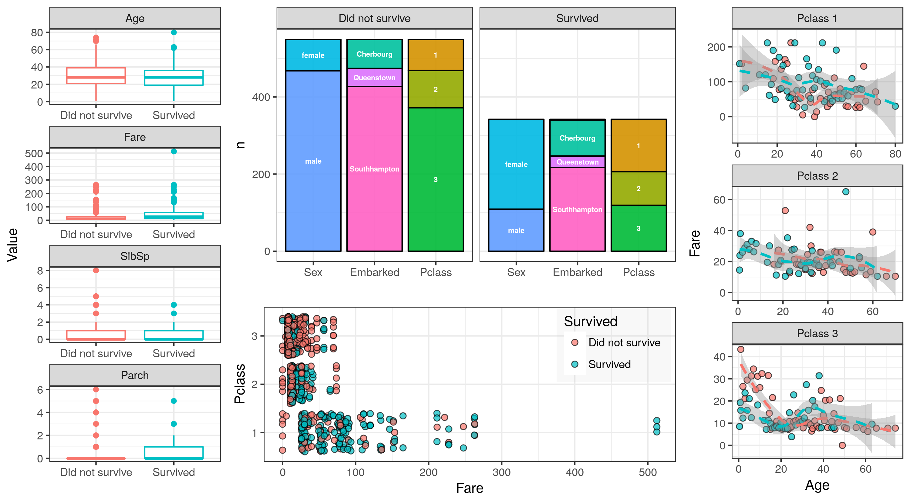

# Q-Step: Data visualisation in R

Yi Liu <y.liu3[at]exeter.ac.uk>

> We will introduce the common approaches to data visualisation in R, including
> line / bar charts, scatterplots, histogram and density plots in base R and
> using the ggplot2 package. We will also discuss the aesthetics, geoms and
> faceting systems in ggplot2. Please bring your own laptop with R, RStudio,
> and the following packages installed: "tidyverse", "titanic".
>
> Read more at http://socialsciences.exeter.ac.uk/q-step/events/#ukDbkzTJJlhBdVXc.99

The teaching materials for the Q-Step *Data visualisation in R* workshop are included in this folder, or in its [online Github repository](https://github.com/YiLiu6240/exeter-qstep-data-visualisation-workshop).

# Usage

If you are using the materials offline, the main material to use is [the html version of the tutorial](tutorial.html).
Alternatively, you can use [the markdown version](https://github.com/YiLiu6240/exeter-qstep-data-visualisation-workshop/tutorial.md) rendered as an html page from Github.

All formats of the learning tutorial is generated from [tutorial.R](tutorial.R) using [R Markdown](http://rmarkdown.rstudio.com/articles_report_from_r_script.html).

# Dependency

The following R packages are required for visualisation purposes: `tidyverse`, `titanic`.

Install the packages using the following command in your R session:

> install.packages(c("tidyverse", "titanic"))

To reproduce and compile all the materials from source you will need these other packages as well: `cowplot`, `rmarkdown`, `knitr` and `pander`.
