-   [Preparation](#preparation)
-   [Base R plotting](#base-r-plotting)
    -   [The plotting system in base R](#the-plotting-system-in-base-r)
    -   [Other specialised plots](#other-specialised-plots)
    -   [Saving the plot](#saving-the-plot)
-   [ggplot2: Basics](#ggplot2-basics)
    -   [An example](#an-example)
    -   [Aesthetics and the layering system](#aesthetics-and-the-layering-system)
    -   [Counts and values](#counts-and-values)
    -   [Continuous numerical variables](#continuous-numerical-variables)
    -   [Line charts](#line-charts)
    -   [Exercise:](#exercise)
-   [ggplot2: Beyond basics](#ggplot2-beyond-basics)
    -   [Facetting: `facet_wrap` and `facet_grid`](#facetting-facet_wrap-and-facet_grid)
    -   [Figure decorations](#figure-decorations)
    -   [Saving the plot](#saving-the-plot-1)
    -   [Wrapping up](#wrapping-up)
    -   [Exercise:](#exercise-1)
-   [Where to go from here](#where-to-go-from-here)
    -   [What can we learn from Titanic data](#what-can-we-learn-from-titanic-data)
    -   [Resources](#resources)

------------------------------------------------------------------------

Download materials from Q-Step ELE page (log-in required)

> <http://vle.exeter.ac.uk/course/view.php?id=6042>

or from Github

> <https://github.com/YiLiu6240/exeter-qstep-data-visualisation-workshop>

------------------------------------------------------------------------

This is the Exeter Q-step workshop guide to data visualisation in R. We will be covering the basics of plotting in base R and using the package `"ggplot2"`.

For the purpose of this workshop, we will use the [`titanic`](https://cran.r-project.org/web/packages/titanic/index.html) dataset to demonstrate how data visualisation works in R.

It is recommended to use [RStudio](https://www.rstudio.com/) for this workshop.

Preparation
===========

------------------------------------------------------------------------

Use the code below to initialise the working environment.

``` r
# If you need to install these packages
install.packages(c("tidyverse", "titanic"),
                 repos = "https://cran.rstudio.com")
```

``` r
library("tidyverse")
library("titanic")
```

------------------------------------------------------------------------

The data set we are going to use is the training split of the titanic data.

``` r
# We create a tibble dataframe called `df` from `titanic_train`
df <- titanic_train %>% as_tibble()
df %>% glimpse()
```

    ## Observations: 891
    ## Variables: 12
    ## $ PassengerId <int> 1, 2, 3, 4, 5, 6, 7, 8, 9, 10, 11, 12, 13, 14, 15,...
    ## $ Survived    <int> 0, 1, 1, 1, 0, 0, 0, 0, 1, 1, 1, 1, 0, 0, 0, 1, 0,...
    ## $ Pclass      <int> 3, 1, 3, 1, 3, 3, 1, 3, 3, 2, 3, 1, 3, 3, 3, 2, 3,...
    ## $ Name        <chr> "Braund, Mr. Owen Harris", "Cumings, Mrs. John Bra...
    ## $ Sex         <chr> "male", "female", "female", "female", "male", "mal...
    ## $ Age         <dbl> 22, 38, 26, 35, 35, NA, 54, 2, 27, 14, 4, 58, 20, ...
    ## $ SibSp       <int> 1, 1, 0, 1, 0, 0, 0, 3, 0, 1, 1, 0, 0, 1, 0, 0, 4,...
    ## $ Parch       <int> 0, 0, 0, 0, 0, 0, 0, 1, 2, 0, 1, 0, 0, 5, 0, 0, 1,...
    ## $ Ticket      <chr> "A/5 21171", "PC 17599", "STON/O2. 3101282", "1138...
    ## $ Fare        <dbl> 7.250, 71.283, 7.925, 53.100, 8.050, 8.458, 51.862...
    ## $ Cabin       <chr> "", "C85", "", "C123", "", "", "E46", "", "", "", ...
    ## $ Embarked    <chr> "S", "C", "S", "S", "S", "Q", "S", "S", "S", "C", ...

------------------------------------------------------------------------

The first 10 rows of the dataset:

``` r
df %>% head(10) %>% knitr::kable()
```

|  PassengerId|  Survived|  Pclass| Name                                                | Sex    |  Age|  SibSp|  Parch| Ticket           |    Fare| Cabin | Embarked |
|------------:|---------:|-------:|:----------------------------------------------------|:-------|----:|------:|------:|:-----------------|-------:|:------|:---------|
|            1|         0|       3| Braund, Mr. Owen Harris                             | male   |   22|      1|      0| A/5 21171        |   7.250|       | S        |
|            2|         1|       1| Cumings, Mrs. John Bradley (Florence Briggs Thayer) | female |   38|      1|      0| PC 17599         |  71.283| C85   | C        |
|            3|         1|       3| Heikkinen, Miss. Laina                              | female |   26|      0|      0| STON/O2. 3101282 |   7.925|       | S        |
|            4|         1|       1| Futrelle, Mrs. Jacques Heath (Lily May Peel)        | female |   35|      1|      0| 113803           |  53.100| C123  | S        |
|            5|         0|       3| Allen, Mr. William Henry                            | male   |   35|      0|      0| 373450           |   8.050|       | S        |
|            6|         0|       3| Moran, Mr. James                                    | male   |   NA|      0|      0| 330877           |   8.458|       | Q        |
|            7|         0|       1| McCarthy, Mr. Timothy J                             | male   |   54|      0|      0| 17463            |  51.862| E46   | S        |
|            8|         0|       3| Palsson, Master. Gosta Leonard                      | male   |    2|      3|      1| 349909           |  21.075|       | S        |
|            9|         1|       3| Johnson, Mrs. Oscar W (Elisabeth Vilhelmina Berg)   | female |   27|      0|      2| 347742           |  11.133|       | S        |
|           10|         1|       2| Nasser, Mrs. Nicholas (Adele Achem)                 | female |   14|      1|      0| 237736           |  30.071|       | C        |

------------------------------------------------------------------------

Meanings of categorical variables

-   **`Survived`**: whether the passenger survived; 0: Did not survive, 1: Survived
-   **`pclass`**: ticket class; 1st, 2nd, 3rd
-   **`SibSp`**: Number of siblings / spouses aboard
-   **`Parch`**: Numebr of parents / children aboard
-   **`Embarked`**: Port of Embarkation; C: Cherbourg, Q: Queenstown, S: Southhampton

------------------------------------------------------------------------

We would also need to use a factor type for the categorical variables that are not numerical in nature:

``` r
df <- titanic_train %>% as_tibble() %>%
  mutate_at(vars(PassengerId, Survived, Pclass), as.factor)
df %>% glimpse()
```

    ## Observations: 891
    ## Variables: 12
    ## $ PassengerId <fctr> 1, 2, 3, 4, 5, 6, 7, 8, 9, 10, 11, 12, 13, 14, 15...
    ## $ Survived    <fctr> 0, 1, 1, 1, 0, 0, 0, 0, 1, 1, 1, 1, 0, 0, 0, 1, 0...
    ## $ Pclass      <fctr> 3, 1, 3, 1, 3, 3, 1, 3, 3, 2, 3, 1, 3, 3, 3, 2, 3...
    ## $ Name        <chr> "Braund, Mr. Owen Harris", "Cumings, Mrs. John Bra...
    ## $ Sex         <chr> "male", "female", "female", "female", "male", "mal...
    ## $ Age         <dbl> 22, 38, 26, 35, 35, NA, 54, 2, 27, 14, 4, 58, 20, ...
    ## $ SibSp       <int> 1, 1, 0, 1, 0, 0, 0, 3, 0, 1, 1, 0, 0, 1, 0, 0, 4,...
    ## $ Parch       <int> 0, 0, 0, 0, 0, 0, 0, 1, 2, 0, 1, 0, 0, 5, 0, 0, 1,...
    ## $ Ticket      <chr> "A/5 21171", "PC 17599", "STON/O2. 3101282", "1138...
    ## $ Fare        <dbl> 7.250, 71.283, 7.925, 53.100, 8.050, 8.458, 51.862...
    ## $ Cabin       <chr> "", "C85", "", "C123", "", "", "E46", "", "", "", ...
    ## $ Embarked    <chr> "S", "C", "S", "S", "S", "Q", "S", "S", "S", "C", ...

Base R plotting
===============

The plotting system in base R
-----------------------------

Base R plotting is done primarily by the `plot` function:

``` r
plot(x = df$Age, y = df$Fare,
     main = "Your plot title", sub = "Your plot subtitle",
     type = "p", col = "#9d0006")
```

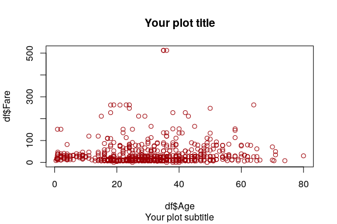

------------------------------------------------------------------------

``` r
plot(x = df$Age[df$Survived == 1], y = df$Fare[df$Survived == 1],
     main = "Scatter plot of 'Age ~ Fare'",
     sub = "How can one survive the Titanic accident",
     xlab = "Age", ylab = "Fare",
     type = "p", col = "#458588")
points(x = df$Age[df$Survived == 0], y = df$Fare[df$Survived == 0],
       type = "p", col = "#9d0006")
legend(x = "topright",
       legend = c("Survived", "Did not survive"),
       lty = 2,
       col = c("#458588", "#9d0006"))
```

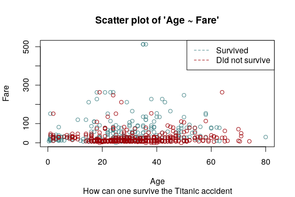

Other specialised plots
-----------------------

### Histograms

``` r
hist(df$Age)
```

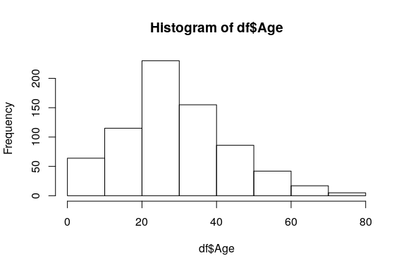

------------------------------------------------------------------------

### Density plots

``` r
density_age <- density(na.omit(df$Age))
plot(density_age)
```

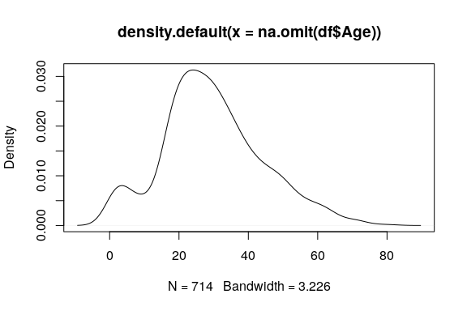

Alternatively, you can chain the procedure using a `%>%` pipe:

``` r
df$Age %>% na.omit() %>%
  density() %>% plot()
```

Saving the plot
---------------

``` r
png("base-r-density-plot.png",
    width = 7.2, height = 4.8, units = "in", res = 300)
df$Age %>% na.omit() %>%
  density() %>% plot()
dev.off()
```

ggplot2: Basics
===============

An example
----------

``` r
ggplot(data = df,
       mapping = aes(x = Age, y = Fare)) +
  geom_point(aes(color = Survived))
```

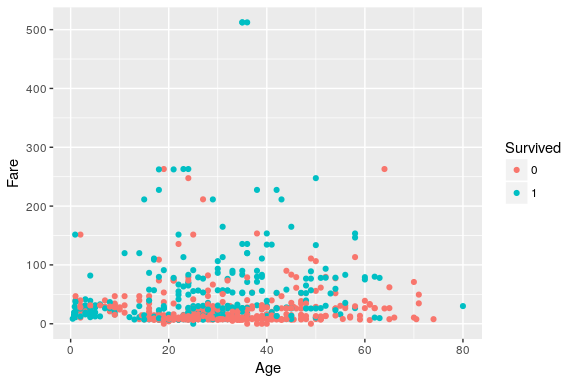

Alternatively you can write the above code as

``` r
df %>% ggplot(aes(Age, Fare)) +
  geom_point(aes(color = Survived))
```

Aesthetics and the layering system
----------------------------------

What if we want a scatter plot of "Sex ~ Fare"?

``` r
df %>% ggplot(aes(x = Sex, y = Fare)) +
  geom_point(aes(color = Survived))
```

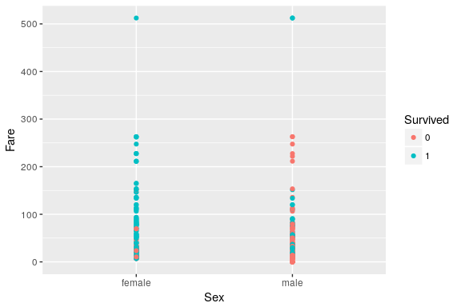

------------------------------------------------------------------------

We need to change the main geom (geometric object) to `geom_jitter` when variables on both axes are categorical.

``` r
df %>% ggplot(aes(x = Sex, y = Fare)) +
  geom_jitter(aes(color = Survived))
```

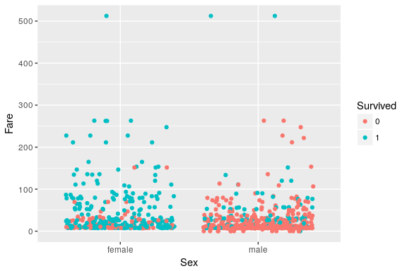

------------------------------------------------------------------------

Alternatively we can do a boxplot:

``` r
df %>% ggplot(aes(x = Sex, y = Fare)) +
  geom_boxplot()
```

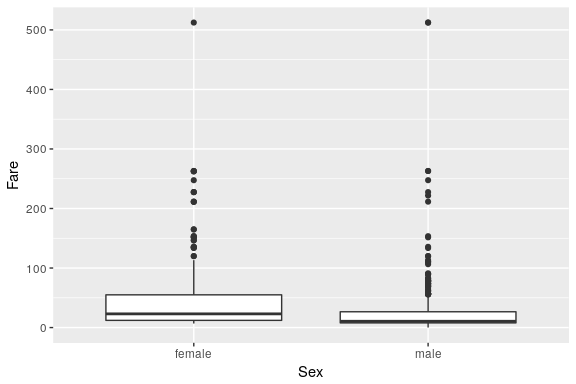

Counts and values
-----------------

``` r
df %>% ggplot(aes(x = Pclass)) +
  geom_bar(stat = "count")
df %>% ggplot(aes(x = Pclass)) +
  geom_bar(aes(fill = Survived),
           stat = "count", position = "stack")
```

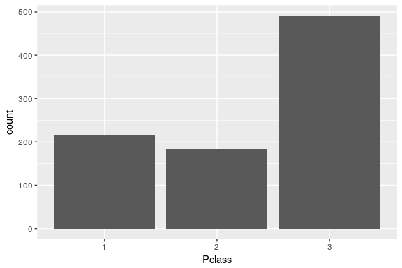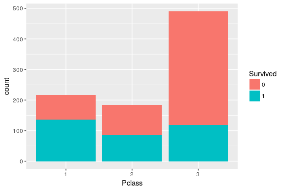

------------------------------------------------------------------------

When you need to supply your own `y` in a barchart:

``` r
df %>% group_by(Survived, Pclass) %>%
  summarise(AverageFare = mean(Fare, na.rm = TRUE)) %>%
  ggplot(aes(x = Pclass, y = AverageFare)) +
  # `geom_bar(stat = "identity", ...)` is equivalent to `geom_col(..)`
  geom_col(aes(fill = Survived), position = "dodge")
```

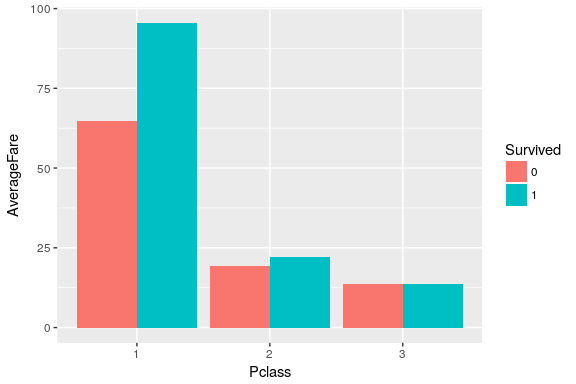

Continuous numerical variables
------------------------------

``` r
df %>% ggplot(aes(x = Fare)) +
  geom_histogram(aes(fill = Survived), position = "stack")
df %>% ggplot(aes(x = Age)) +
  geom_density(aes(fill = Survived), alpha = 0.6)
```

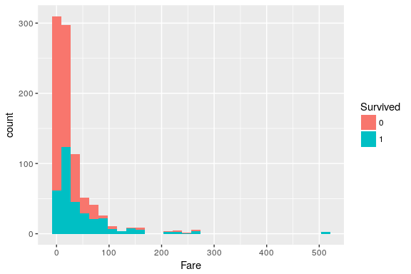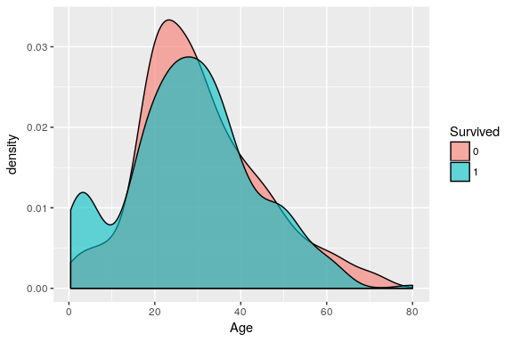

Line charts
-----------

For line charts that represent connections, we ususally need to specify a "group" aesthetics.

``` r
df %>%
  filter(Embarked != "") %>%
  mutate(Embarked = Embarked %>% factor(levels = c("S", "C", "Q"))) %>%
  group_by(Embarked, Survived) %>%
  summarise(AverageFare = mean(Fare, na.rm = TRUE)) %>%
  ggplot(aes(x = Embarked, y = AverageFare,
             colour = Survived, group = Survived)) +
  geom_point() + geom_line()
```

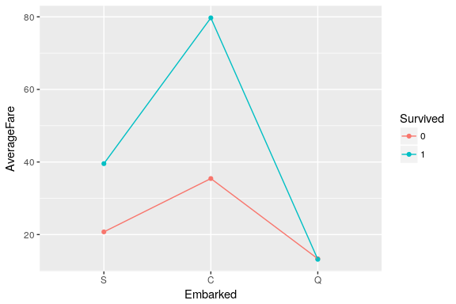

Exercise:
---------

> Practice with the ggplot2 geoms and aesthetics with the titanic data, using the examples above.

ggplot2: Beyond basics
======================

Facetting: `facet_wrap` and `facet_grid`
----------------------------------------

``` r
df %>% ggplot(aes(x = Age, y = Fare)) +
  geom_point(aes(color = Survived)) +
  facet_wrap(~ Sex)
```

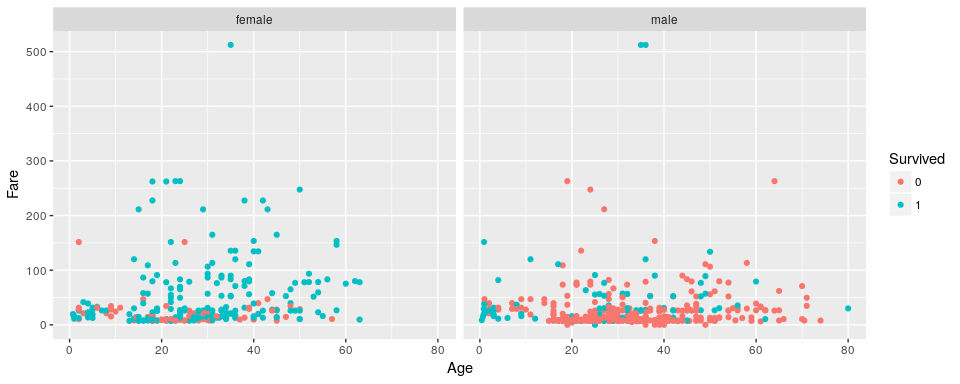

------------------------------------------------------------------------

`facet_wrap` allows for flexible column layout:

``` r
df %>% ggplot(aes(x = Age, y = Fare)) +
  geom_point(aes(color = Survived)) +
  facet_wrap(Pclass ~ Sex, ncol = 2)
```

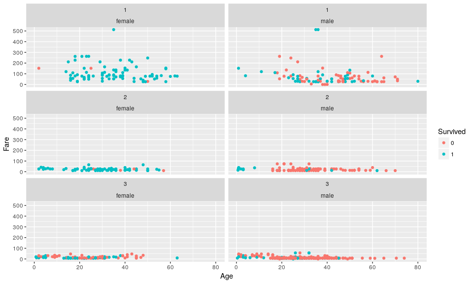

------------------------------------------------------------------------

`facet_grid` is more ideal for facetting with 2 factors:

``` r
df %>% ggplot(aes(x = Age, y = Fare)) +
  geom_point(aes(color = Survived)) +
  facet_grid(Pclass ~ Sex, scales = "free_y")
```

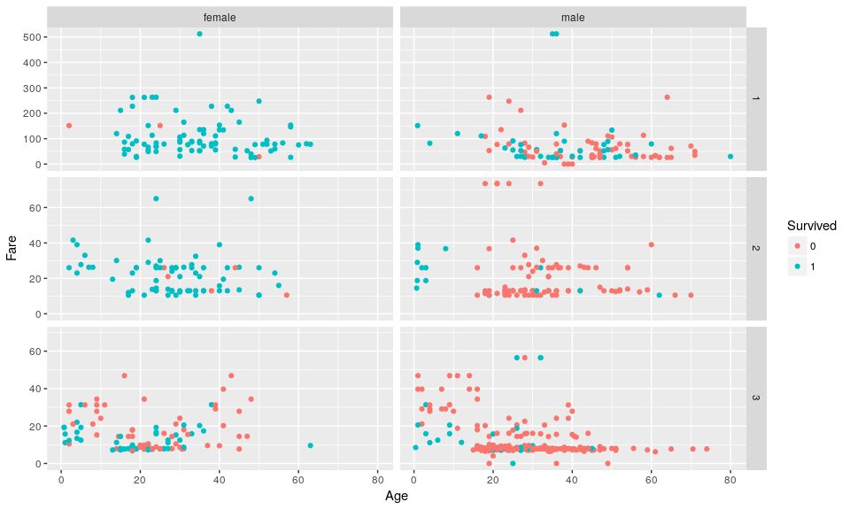

Figure decorations
------------------

Configurations regarding the figure as a whole are provided by the `theme()` function. Read all the available options [here](http://ggplot2.tidyverse.org/reference/theme.html).

Change the position of the figure legend:

``` r
df %>% ggplot(aes(x = Age, y = Fare)) +
  geom_point(aes(color = Survived)) +
  facet_grid(Pclass ~ Sex, scales = "free_y") +
  theme(legend.position = "bottom")
```

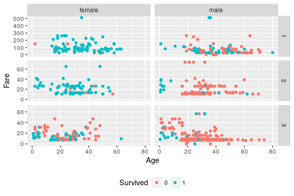

------------------------------------------------------------------------

Add title and other elements:

``` r
df %>% ggplot(aes(x = Age, y = Fare)) +
  geom_point(aes(color = Survived)) +
  facet_grid(Pclass ~ Sex, scales = "free_y") +
  labs(title = "Place your title here",
       subtitle = "Place your subtitle here",
       x = "Age of passengers",
       y = "Trip fare") +
  theme_classic()
```

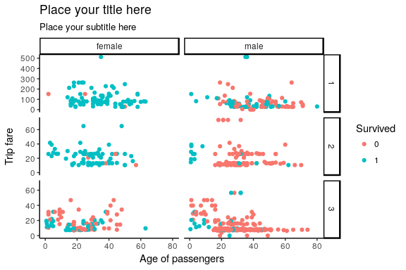

Saving the plot
---------------

Saving a ggplot object is done by the `ggsave` function.

``` r
# Option 1: Assign the ggplot object to a variable
fig <- df %>% ggplot(aes(x = Age, y = Fare)) +
  geom_point(aes(color = Survived)) +
  facet_grid(Pclass ~ Sex, scales = "free_y") +
  labs(title = "Place your title here",
       subtitle = "Place your subtitle here",
       x = "Age of passengers",
       y = "Trip fare") +
  theme_classic()
ggsave(filename = "ggplot-figure.png", plot = fig,
       width = 7.2, height = 4.8, units = "in", dpi = 300)
# Option 2: Evaluate your plot within `()` then chain it
(
  df %>% ggplot(aes(x = Age, y = Fare)) +
    geom_point(aes(color = Survived)) +
    facet_grid(Pclass ~ Sex, scales = "free_y") +
    labs(title = "Place your title here",
         subtitle = "Place your subtitle here",
         x = "Age of passengers",
         y = "Trip fare") +
    theme_classic()
) %>%
  ggsave(filename = "ggplot-figure.png",
         width = 7.2, height = 4.8, units = "in", dpi = 300)
```

Wrapping up
-----------

Plotting in ggplot2 is done by:

-   Calling `ggplot(data)` to initialise the plotting process
-   Global aesthetics are specified by a `aes(x = ..., y = ..., ...)` function
-   Specific plotting layers are provided by the `geom_` functions
-   Fine-tune your plots with other functions

Exercise:
---------

Let us practice what we learn today and see if you could reproduce one of the following figures.

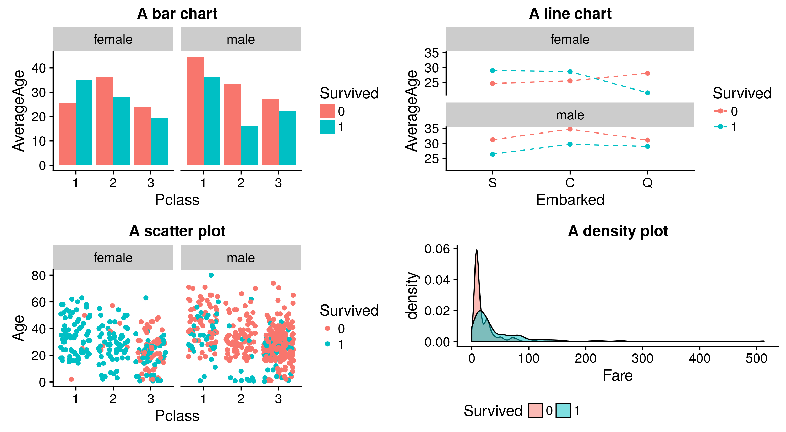

Where to go from here
=====================

What can we learn from Titanic data
-----------------------------------

Exploratory data analysis assisted by visualisation is only the first step in your analysis.


Resources
---------

-   Reference manuals and websites:

    -   ggplot2 reference: <http://ggplot2.tidyverse.org/index.html>
    -   R graphics cookbook: <http://www.cookbook-r.com/Graphs/>
    -   R for Data Science: <http://r4ds.had.co.nz/>

-   Extensions to `ggplot2`:

    -   ggthemes: <https://github.com/jrnold/ggthemes>
    -   cowplot: <https://cran.r-project.org/web/packages/cowplot/vignettes/introduction.html>

------------------------------------------------------------------------

-   Interactive plots:

    -   plotly: <https://plot.ly/r/>
    -   bokeh: <http://hafen.github.io/rbokeh/index.html>

-   Other types of plots:

    -   correlation plots: <https://cran.r-project.org/web/packages/corrplot/vignettes/corrplot-intro.html>
    -   maps: <https://github.com/mtennekes/tmap>
    -   treemaps: <https://cran.r-project.org/web/packages/treemap/vignettes/treemap-color_mapping.html>
